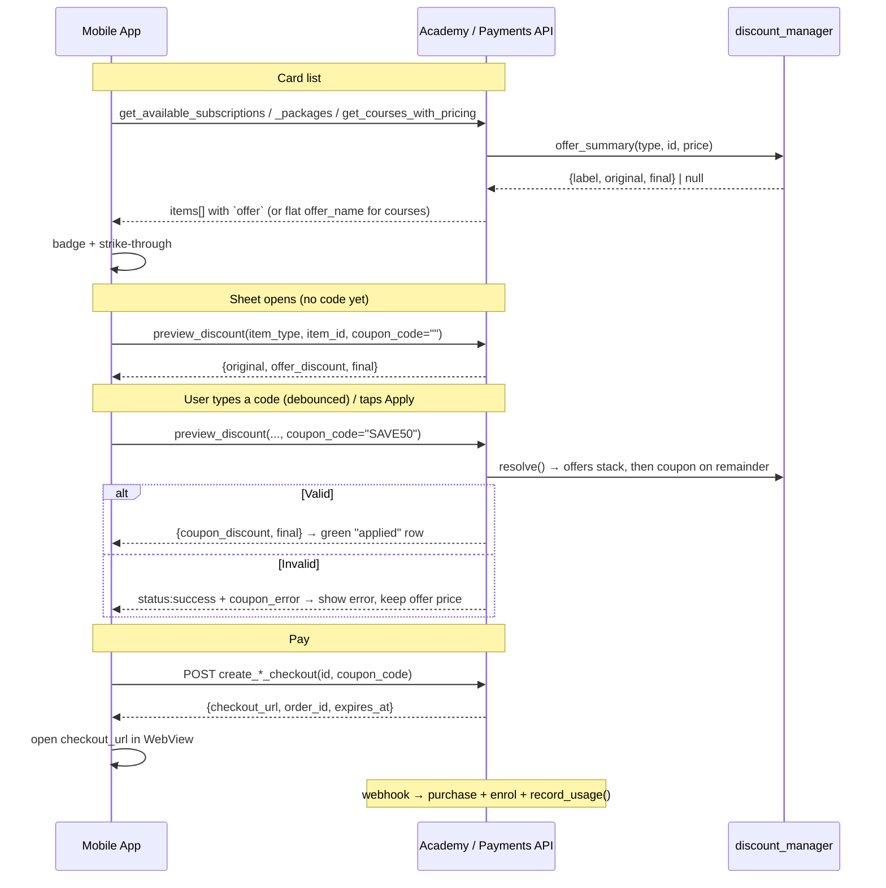

# Coupons & Offers — Mobile Developer Guide

**The single source of truth** for showing automatic **offers** and letting a student apply a
**coupon code** in the mobile app, across all three things a student can buy:

| Flow | What the student buys |
|---|---|
| **Courses** | A single course — the *"الكورسات التعليمية"* section |
| **Packages** | A bundle of Flex lesson credits |
| **Subscriptions** | Time-based access to a set of courses |

This guide mirrors exactly what the website does at
[academy2026.nitg-eg.com](https://academy2026.nitg-eg.com/). If the app calls these endpoints the
same way, it behaves identically.

> This file replaces `coupons-offers-mobile-handoff.md` and `subscriptions-offers-coupons-mobile.md`.
> For API changes made on 2026-07-18 (course offers in the catalog, course coupons at checkout), see
> [`coupons-offers-api-changes.md`](coupons-offers-api-changes.md).

Implements US-US-OF-1-1 / US-US-OF-1-2 (offers) and US-US-CP-1-2 (coupons).

---

## 1. Business rules — read this first

Both discount kinds are computed by one shared engine,
[`discount_manager`](../../src/local/academy/classes/discount_manager.php). **Never compute prices in
the app** — always display what the server returns.

| | **Offers** (automatic) | **Coupons** (manual) |
|---|---|---|
| Applied | Automatically, by admin rule | Only when the user types a code |
| User action | None | Enter code → Apply |
| Where it shows | Card badge + strike-through price | Checkout sheet only |

**Order of operations** — this is why client-side math will be wrong:

1. Start from the item's base `price`.
2. **Offers stack**: every matching active offer's discount is computed on the *base* price and
   **summed** (two 30% offers = 60% off, not 51%).
3. **The coupon applies to the remainder** — i.e. to the *offer-adjusted* price, not the base.
4. A coupon may carry a `max_discount` cap (e.g. "50% off, up to 50 EGP").
5. The final price is clamped to **≥ 0**.

### Three rules that will bite you

- 🚫 **B2B subscription purchases ignore offers and coupons entirely.** A B2B checkout
  (`type=b2b&seats=N`) is priced only by its seat-option discount; any `coupon_code` you send is
  silently ignored — see [`manager.php:400`](../../src/local/payments/classes/manager.php#L400).
  **Hide the coupon field on the B2B sheet.**
- 👤 **One active *normal* subscription at a time.** If the user already holds one, checkout throws
  `err_alreadyhassubscription`. B2B is separate and unaffected.
- 🔑 **`preview_discount` requires a token** → guests cannot preview. Show guests a "Log in to buy"
  button, exactly as the web does.

---

## 2. The two APIs involved

Coupons and offers span **two different plugins**, and they authenticate differently. This is the
single most common source of confusion.

### A. Academy API — `/local/academy/api.php`

Used for: packages, subscriptions, and **the shared `preview_discount` endpoint for all three types**.

```
{BASE_URL}/local/academy/api.php?function=...&token=...
```

- **Auth**: `token` on every call (from `POST /login/token.php`, `service=moodle_mobile_app`).
- **Language**: pass `alang=en|ar` — **not** `lang`. `lang` clobbers the session language; `alang` is
  the project's dedicated param. Server error messages come back translated.
- **Envelope**: `{"status":"success","data":...}` or `{"status":"fail","error":"..."}`.
- ⚠️ An invalid/expired token returns an **HTML** page, not JSON → treat any non-JSON body as
  "session expired → re-login".

### B. Payments web services — standard Moodle WS

Used for: course catalog and course checkout.

```
{BASE_URL}/webservice/rest/server.php?wstoken=...&wsfunction=...&moodlewsrestformat=json
```

- **Auth**: `wstoken` (same token, different param name).
- **Errors**: a Moodle exception envelope — `{"exception":"moodle_exception","errorcode":"...","message":"..."}`.

---

## 3. Quick reference — which call for which flow

| | **Courses** | **Packages** | **Subscriptions** |
|---|---|---|---|
| **List / cards** | `local_payments_get_courses_with_pricing` <sub>(payments WS)</sub> | `get_available_packages` <sub>(academy)</sub> | `get_available_subscriptions` <sub>(academy)</sub> |
| **Offer shown as** | flat fields + `offer_name` | nested `offer` object | nested `offer` object |
| **Price preview / validate coupon** | `preview_discount` <br>`item_type=course` | `preview_discount` <br>`item_type=package` | `preview_discount` <br>`item_type=subscription` |
| **Start payment** | `local_payments_create_checkout` <sub>(payments WS)</sub> | `create_package_checkout` <sub>(academy, POST)</sub> | `create_subscription_checkout` <sub>(academy, POST)</sub> |
| **Coupon param** | `coupon_code` | `coupon_code` | `coupon_code` |

⚠️ **Note the asymmetry**: courses return offer data as *flat fields* on each course, while packages
and subscriptions return a nested `offer` object. Same underlying data, two shapes. Handle both.

---

## 4. Rendering cards

### 4a. Courses — `local_payments_get_courses_with_pricing`

```
GET {BASE_URL}/webservice/rest/server.php
    ?wstoken=TOKEN
    &wsfunction=local_payments_get_courses_with_pricing
    &moodlewsrestformat=json
    &field=category&value=5      ← optional filter; omit both for all courses
    &country=EG                  ← optional, overrides IP-based detection
```

Each course carries the standard Moodle course fields **plus** these pricing fields:

```json
{
  "id": 61,
  "fullname": "Project Management Professional",
  "pricing_country": "EG",
  "currency": "EGP",
  "price": 1000.00,
  "sale_price": 700.00,
  "original_price": 1000.00,
  "discount_percentage": 30,
  "is_sale_active": true,
  "sale_ends_at": 0,
  "is_free": false,
  "is_purchased": false,
  "is_enrolled": false,
  "offer_name": "Flash Sale + Summer Discount"
}
```

| Field | Meaning |
|---|---|
| `price` | Effective price **before** automatic offers (country-resolved, includes any price-table sale) |
| `sale_price` | **The price after offers** — what the student will actually be charged |
| `original_price` | Base price before any discount — use for the strike-through |
| `discount_percentage` | Combined discount vs `original_price`, 0–100 |
| `is_sale_active` | `true` if a price-table sale **or** an automatic offer applies |
| `offer_name` | Names of applied offers, joined with `" + "`. **Empty string ⇒ no offer.** |
| `is_free` | `true` when the course has no pricing rule at all → open access |
| `is_purchased` / `is_enrolled` | Already owns / already enrolled |

**Card rendering logic:**

```dart
if (c['is_free'] == true)                        → "Free" badge, button "Join"
else if (c['is_enrolled'] || c['is_purchased'])  → "Enrolled" badge, button "Open course"
else if (c['is_sale_active'] == true) {
  strikeThrough(c['original_price']);
  showPrice(c['sale_price']);                    // ← charge amount, NOT `price`
  showBadge("-${c['discount_percentage']}%");
  if ((c['offer_name'] as String).isNotEmpty)
    showOfferTag(c['offer_name']);               // e.g. 🏷️ "Flash Sale + Summer Discount"
} else                                            → showPrice(c['price']), button "Buy now"
```

> ⚠️ When an offer applies, **display `sale_price`, not `price`**. `price` is deliberately kept at the
> pre-offer value so you can render a "was → now" comparison, but it is *not* the amount charged.

### 4b. Packages & subscriptions — `get_available_packages` / `get_available_subscriptions`

```
GET {BASE_URL}/local/academy/api.php?function=get_available_subscriptions&token=TOKEN&alang=en
```

Each item already carries a ready-to-display `offer` object — **no separate call needed for the badge**:

```json
{
  "id": 3,
  "name": "Premium Plan",
  "price": "500.00",
  "duration_days": 30,
  "b2b_enabled": 1,
  "seat_options": [ { "seats": 10, "discount_percent": 15 } ],
  "offer": {
    "name": "Ramadan Offer + Flash Sale",
    "discount_type": "percent",
    "discount_value": 30,
    "discount": 150.00,
    "original": 500.00,
    "final": 350.00,
    "label": "-30%"
  }
}
```

- **`offer` is `null`** ⇒ render the plain `price`, no badge.
- **`offer` is present** ⇒ render the badge from **`offer.label`** (pre-formatted, e.g. `"-30%"`),
  **`offer.original`** struck through, and **`offer.final`** as the live price.
- **`offer.name`** joins stacked offer names with `" + "` — good as a subtitle/tooltip.
- ⚠️ **`offer.discount_type` is always `"percent"`** here, even when the underlying offer was a
  *fixed* amount; `discount_value` is the combined **effective** percentage. Just display `label` —
  don't re-derive it.

**Subscription button state:**

| Condition | Button |
|---|---|
| No token (guest) | "Log in to subscribe" → login screen |
| This plan is the user's active one | "Active" (disabled) |
| User has another active normal plan | "Subscribed" (disabled) |
| Otherwise | "Subscribe" → open checkout sheet |
| `b2b_enabled && seat_options.length` | extra "Business (B2B)" button |

Merge with `get_my_subscriptions` to compute these — the web fetches both in parallel and treats only
`type === 'normal' && status === 'active'` as "has an active plan".

---

## 5. The checkout sheet & coupons — `preview_discount`

**One endpoint serves all three item types.** This is what makes the coupon field work. Call it:

- **once when the sheet opens**, with an empty code → shows the automatic-offer price;
- **on "Apply"**, on Enter, and **debounced (~450 ms) while typing** — the web live-updates the total
  as the user types, so they never *have* to tap Apply.

```
GET {BASE_URL}/local/academy/api.php
    ?function=preview_discount
    &item_type=course            ← course | package | subscription
    &item_id=61                  ← the course / package / subscription id
    &coupon_code=SAVE50          ← omit or send "" for the offer-only price
    &token=TOKEN&alang=en
```

Response:

```json
{
  "status": "success",
  "data": {
    "original": 1000.00,
    "offers": [ { "id": 2, "name": "Ramadan Offer", "discount": 300.00 } ],
    "offer_id": 2,
    "offer_name": "Ramadan Offer",
    "offer_discount": 300.00,
    "coupon_id": 7,
    "coupon_code": "SAVE50",
    "coupon_discount": 50.00,
    "discount": 350.00,
    "final": 650.00
  }
}
```

| Field | Use it for |
|---|---|
| `original` | Strike-through base price |
| `offer_discount` | "Offer discount" row (combined; `offers[]` has the per-offer breakdown) |
| `offer_name` | Names of applied offers (comma-joined here) |
| `coupon_discount` | "Coupon discount" row |
| `discount` | Total saved (`original - final`) — the web shows this as one green row |
| `final` | **The amount charged.** Show it as the total. |
| `coupon_error` | Present **only** when the code was rejected — see below |

### ⚠️ The single biggest gotcha: an invalid coupon still returns `status: "success"`

`preview_discount` deliberately **does not fail** on a bad code. It recomputes the price *without* the
coupon and adds a `coupon_error` field, so the sheet can show the offer price **and** the error at the
same time ([`api.php:1234`](../../src/local/academy/api.php#L1234)):

```json
{
  "status": "success",
  "data": {
    "original": 1000.00,
    "offer_discount": 300.00,
    "coupon_discount": 0.00,
    "discount": 300.00,
    "final": 700.00,
    "coupon_error": "This coupon code has expired"
  }
}
```

So your handler must be:

```dart
final d = res['data'];
totalText     = money(d['final']);          // always trust `final`
discountText  = money(d['discount']);
couponError   = d['coupon_error'];          // null ⇒ valid (or no code sent)
couponApplied = (d['coupon_discount'] ?? 0) > 0;
```

**Do not** gate on `status`, and **do not** assume a coupon applied just because the user typed one —
check `coupon_discount > 0` / the absence of `coupon_error`.

`coupon_error` is already **translated** per `alang` — display it verbatim. Possible causes:

| Reason | String key |
|---|---|
| No such code | `err_couponnotfound` |
| Deactivated | `err_couponinactive` |
| Not started yet | `err_couponnotstarted` |
| Expired | `err_couponexpired` |
| Doesn't cover this item | `err_couponnotapplicable` |
| Usage limit reached | `err_couponusedup` |
| Empty code sent | `err_couponcoderequired` |

---

## 6. Paying

All three return the same shape. **Open `checkout_url` in a WebView** → the user pays → the purchase,
enrolment, and offer/coupon **usage logging** all happen server-side on the payment webhook. The app
does not report success itself; refresh the relevant "my ..." list when the WebView returns.

```json
{
  "order_id": "ORD-XXXX",
  "checkout_url": "https://checkout.kashier.io/?...",
  "expires_at": 1760000000,
  "provider": "kashier",
  "transaction_id": 123
}
```

### 6a. Courses — `local_payments_create_checkout`

```
POST {BASE_URL}/webservice/rest/server.php
Content-Type: application/x-www-form-urlencoded

wstoken=TOKEN
&wsfunction=local_payments_create_checkout
&moodlewsrestformat=json
&courseid=61
&country=EG              ← optional
&lang=ar                 ← optional, en|ar (this is the payments WS, so `lang` — not `alang`)
&coupon_code=SAVE50      ← optional; send the SAME code the user previewed
```

Returns the fields above at the top level (no `status` wrapper — this is a plain Moodle WS).

> ⚠️ Unlike `preview_discount`, an **invalid coupon here throws** a `moodle_exception`
> (`errorcode: "err_couponexpired"` etc.). Surface the `message` and re-run `preview_discount`.

### 6b. Packages — `create_package_checkout`

```
POST {BASE_URL}/local/academy/api.php
Content-Type: application/x-www-form-urlencoded

function=create_package_checkout
&token=TOKEN
&packageid=7
&coupon_code=SAVE50      ← optional
&alang=en
```

### 6c. Subscriptions — `create_subscription_checkout`

```
POST {BASE_URL}/local/academy/api.php
Content-Type: application/x-www-form-urlencoded

function=create_subscription_checkout
&token=TOKEN
&subscriptionid=3
&coupon_code=SAVE50      ← optional; IGNORED when type=b2b
&type=normal             ← optional: normal | b2b
&seats=0                 ← B2B only, must match a seat_options entry
&alang=en
```

The academy endpoints are **POST-only** — a GET returns
`{"status":"fail","error":"This action requires POST"}`.

### Three things true of all three flows

1. **Offers are applied automatically at checkout — with or without a coupon.** You do **not** need to
   send anything to get the offer discount. `sending coupon_code=""` (or omitting it entirely) still
   charges the offer-adjusted price, because
   [`apply_academy_discount()`](../../src/local/payments/classes/manager.php#L518) always runs
   `discount_manager::resolve()`, which stacks offers unconditionally and only looks at the coupon
   when a code is present. **`coupon_code` adds a coupon on top of offers — it does not enable offers.**
2. **The server re-resolves the price from scratch** — it never trusts a client-sent amount. The
   coupon is **re-validated** at checkout. If it expired or hit its limit between preview and pay,
   the call fails → surface the error and re-preview.
3. **`expires_at` bounds the payment session** (default 30 min). Past it, create a new checkout.

> This is why the course catalog bug mattered: `create_checkout` has **always** discounted offers,
> while `get_courses_with_pricing` did not report them — so the app displayed one price and the
> student was charged another. See [`coupons-offers-api-changes.md`](coupons-offers-api-changes.md).

### ⚠️ Pending-transaction reuse (courses)

`manager::create_checkout()` returns an **existing pending transaction** if one is still live for the
same user + course ([`manager.php:111`](../../src/local/payments/classes/manager.php#L111)) — and it
returns it *before* applying any coupon. Practical consequence:

> If the user starts a course checkout **without** a coupon, backs out, then retries **with** one,
> they get the original un-discounted `checkout_url` and the coupon is silently ignored.

Mitigation: only call `create_checkout` once the user has committed to a final price, and if the
returned `order_id` matches one you already have, warn the user to complete or let the existing
session expire.

---

## 7. End-to-end flow



---

## 8. Optional: the "My coupons & offers" screen

Not needed for the cards, but available (academy API, token only, all GET):

| `function` | Returns |
|---|---|
| `get_available_coupons` | Active, in-window coupons — `code`, `discount_type`, `discount_value`, `max_discount`, `usage_type`, `usage_limit`, `usage_count`, `startdate`, `enddate`, `applies_to[]` (each `{item_type, item_id, label}`) |
| `get_available_offers` | Active, in-window offers, same shape minus `code` |
| `get_my_coupon_usages` | The user's redemptions — `code`, `item_type`, `item_id`, `original_amount`, `discount_amount`, `final_amount`, `timecreated` |
| `get_my_offer_usages` | Same, for offers |

In `applies_to`, **`item_id: 0` means "all items of that type"** (e.g. `{item_type:"course",
item_id:0}` = every course). Use `label` for display — it's already resolved server-side.

> `get_available_coupons` lists coupons **platform-wide**; it does not filter by what this user can
> still use, and it exposes codes. Fine for a "current promos" screen — but always confirm real
> applicability through `preview_discount`.

---

## 9. Checklist

- [ ] Courses: display `sale_price` (not `price`) when `is_sale_active`; show `offer_name` tag when non-empty
- [ ] Packages/subscriptions: badge from `item.offer.label`; `offer == null` ⇒ no badge, plain `price`
- [ ] Strike-through `original_price` / `offer.original`
- [ ] `preview_discount` on sheet open with an empty code (shows offer price)
- [ ] Debounce typing (~450 ms) + Apply button + Enter key all call `preview_discount`
- [ ] Handle `coupon_error` **inside a `status: success`** response
- [ ] Always display `final` from the server — never compute prices in the app
- [ ] Pass the same `coupon_code` to the checkout call; handle re-validation failure
- [ ] Hide the coupon field for B2B subscriptions (`type=b2b`) — offers/coupons don't apply
- [ ] Guests: "Log in to buy", no preview call
- [ ] Academy API: use `alang`, not `lang`; non-JSON response ⇒ session expired ⇒ re-login
- [ ] Courses: beware pending-transaction reuse (§6) when retrying a checkout with a coupon

---

## 10. Reference — where this lives in the code

| Concern | File |
|---|---|
| Discount engine (stacking, validation, resolve) | [`discount_manager.php`](../../src/local/academy/classes/discount_manager.php) |
| `preview_discount` handler | [`api.php:1228`](../../src/local/academy/api.php#L1228) |
| `offer` on each plan (`format_plan`) | [`subscription_purchase_manager.php:637`](../../src/local/academy/classes/subscription_purchase_manager.php#L637) |
| `offer` on each package | [`purchase_manager.php:26`](../../src/local/academy/classes/purchase_manager.php#L26) |
| Course catalog + offer fold-in | [`get_courses_with_pricing.php`](../../src/local/payments/classes/external/get_courses_with_pricing.php) |
| Course checkout WS | [`create_checkout.php`](../../src/local/payments/classes/external/create_checkout.php) |
| `create_subscription_checkout` handler | [`api.php:461`](../../src/local/academy/api.php#L461) |
| `create_package_checkout` handler | [`api.php:579`](../../src/local/academy/api.php#L579) |
| Checkout + B2B exclusion rule | [`manager.php:366`](../../src/local/payments/classes/manager.php#L366) |
| **Web reference — cards + coupon modal** | [`lib.php:400-442`](../../src/local/academy/lib.php#L400) |
| **Web reference — course buy page** | [`buy.php`](../../src/local/payments/buy.php) / [`checkout.php`](../../src/local/payments/checkout.php) |

When in doubt about a behavior, [`lib.php`](../../src/local/academy/lib.php) and
[`buy.php`](../../src/local/payments/buy.php) are ground truth — they are the code running on the
live site.
