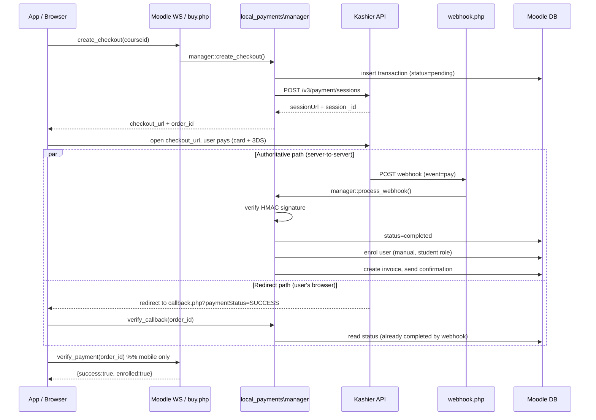

# Kashier Payment Flow — `local_payments`

How a course purchase flows through the `local_payments` plugin and the
`paymentprovider_kashier` provider, from "Buy" to the student being enrolled.

- Plugin root: `src/local/payments/`
- Kashier provider: `src/local/payments/provider/kashier/` (frankenstyle `paymentprovider_kashier`)
- Moodle 3.11.8, running in Docker (`academy_app`).

---

## 1. Architecture in one paragraph

`local_payments` is a **generic** course-payment framework. It never talks to
Kashier directly — it talks to a **provider interface**
(`classes/provider/provider_interface.php`). Kashier is one implementation
(`provider/kashier/classes/gateway.php`). Which provider handles a given
purchase is decided at runtime by the buyer's **country** and the course's
**currency** (`manager::get_provider()`), so new providers (PayPal, etc.) can be
added without touching the core flow.

The single orchestrator is `local_payments\manager`. Everything below routes
through it.

---

## 2. The happy path (end to end)



The key idea: **the webhook is the source of truth for enrollment.** The
redirect/callback and the mobile `verify_payment` call are just ways to *read*
the result the webhook already wrote (with an API fallback if the webhook
hasn't landed yet).

---

## 3. Step by step

### Step 1 — Create the checkout
`manager::create_checkout($courseid, $userid, $country, $lang)`
(`classes/manager.php`)

1. Resolves the price for the buyer's country (`price_resolver::resolve`).
2. **Reuses** an existing non-expired pending transaction if one exists
   (returns its `checkout_url`) — avoids creating duplicate Kashier sessions.
3. Rejects if already purchased (`alreadypurchased`) or already enrolled
   (`alreadyenrolled`).
4. Picks the provider via `get_provider(country, currency)`.
5. Generates an `order_id` (`PAY-YYYY-nnnnnnnn`) and an idempotency key.
6. Inserts a transaction row with `status = pending` and an `expires_at`
   (default TTL 1800s / 30 min, from `local_payments/payment_ttl`).
7. Builds three URLs and hands them to the provider:
   - `webhook_url`  → `/local/payments/webhook.php?provider=kashier`
   - `success_url`  → `/local/payments/callback.php?order_id=...`
   - `failure_url`  → `/local/payments/callback.php?order_id=...&status=failed`
8. Calls `gateway::initialize_payment()`.

### Step 2 — Kashier session creation
`gateway::initialize_payment()` (`provider/kashier/classes/gateway.php`)

`POST {base_url}/v3/payment/sessions` with:

| Field | Source |
|---|---|
| `merchantId` | `paymentprovider_kashier/merchant_id` |
| `order` | our `order_id` |
| `amount`, `currency` | resolved price |
| `serverWebhook` | our `webhook_url` |
| `merchantRedirect` | our `success_url` |
| `failureRedirect` | `true` (Kashier expects a boolean here) |
| `customer` | `{ reference: userid, email }` |
| `metaData` | `transaction_id`, `courseid`, `moodle_order_id` |
| `enable3DS`, `allowedMethods` | provider settings |

Auth headers: `Authorization: <secret_key>` and `api-key: <api_key>`.

- `base_url` = `https://test-api.kashier.io` (sandbox) / `https://api.kashier.io` (live).
- Response gives `sessionUrl` (the `checkout_url` we return) and `_id` (stored
  as `provider_session_id`).

### Step 3 — User pays
The app opens `checkout_url` in a WebView (or the browser redirects to it from
`buy.php`). The user enters card details; 3D-Secure runs on Kashier's side. We
are not involved during this step.

### Step 4a — Webhook (authoritative)
`webhook.php` → `manager::process_webhook()` → `gateway::handle_webhook()`

1. `webhook.php` runs with `NO_MOODLE_COOKIES` (no session — it's
   server-to-server), reads the raw JSON body and the headers.
2. **Signature verification** (`gateway::verify_signature`): take
   `data.signatureKeys`, sort them alphabetically, build
   `key1=urlencode(v1)&key2=urlencode(v2)...`, compute
   `HMAC-SHA256(message, api_key)`, and compare (constant-time) to the
   `x-kashier-signature` header. A bad signature marks the webhook `failed` and
   stops — **no enrollment on an unverified webhook.**
3. Find the transaction by `merchantOrderId` (our `order_id`), fall back to the
   `transaction_id` embedded in `metaData`.
4. **Idempotency**: if the transaction is already `completed`, ack and stop.
5. For a `pay` / `capture` event with status `SUCCESS`:
   - **Amount check** — reject if `|expected - received| > 0.01` (guards against
     tampering).
   - Set status `completed`.
   - **Enrol the student** via `enrollment_handler::enrol_user()` — manual
     enrolment instance, student role (id 5). Creates the manual instance if the
     course doesn't have one.
   - Generate the invoice, send the confirmation message, fire the
     `payment_completed` event.
6. Every webhook is stored in `local_payments_webhooks` (raw payload, headers,
   signature validity, processed status) for auditing.

Non-`SUCCESS` statuses move the transaction to `failed`. `refund` / `void`
events transition to `refunded` / `partially_refunded` / `voided`.

### Step 4b — Redirect callback (browser) — runs in parallel
`callback.php` → `manager::verify_callback($order_id)`

- Kashier redirects the user's browser to `callback.php` with
  `paymentStatus=SUCCESS|FAILED`.
- `paymentStatus=FAILED` → mark the pending transaction `failed`, show the
  failure page.
- Otherwise `verify_callback()`:
  - If the transaction is **already `completed`** (webhook already ran), return
    success immediately.
  - If **not** (webhook hasn't landed yet), fall back to
    `gateway::verify_payment()` — `GET /v3/payment/sessions/{sessionId}/payment`
    — and if Kashier confirms `SUCCESS`/`CAPTURED` (and the amount matches),
    complete + enrol right here. This makes the flow resilient to a slow or
    missed webhook.

### Step 5 — Mobile confirmation
`local_payments_verify_payment` (WS) → same `manager::verify_callback()`.

After the WebView detects the `callback.php` URL and closes, the app calls
`verify_payment(order_id)` and reads `{ success, enrolled, status, courseid }`.
Because the webhook is authoritative, this usually just reads the already-written
`completed` state; the Kashier API fallback covers the race where the webhook is
late.

---

## 4. Status machine

Transactions move through (`classes/status_machine.php`):

```
pending ──► completed ──► refunded / partially_refunded
   │                └────► voided
   └──► failed
```

Guarded by `status_machine::can_transition()` so a late/duplicate webhook can't,
e.g., un-fail a completed payment.

---

## 5. Data touched

| Table | Purpose |
|---|---|
| `local_payments_transactions` | one row per checkout; the order lifecycle |
| `local_payments_providers` | enabled providers, priority, supported countries/currencies |
| `local_payments_course_prices` | per-course pricing rules (country, currency, sale) |
| `local_payments_webhooks` | every inbound webhook + signature result |
| `local_payments_audit_logs` | status changes, enrolments |
| `local_payments_logs` | provider-level info/error logs |
| `local_payments_invoices` | generated invoices |

---

## 6. Security properties

- **Signed webhooks** — HMAC-SHA256 over Kashier's `signatureKeys`, keyed with
  the API key. Unsigned/invalid → ignored.
- **Amount validation** — server re-checks the paid amount against the stored
  transaction before enrolling.
- **Idempotency** — completed transactions short-circuit; duplicate webhooks are
  safe.
- **No trust in the redirect** — `paymentStatus=SUCCESS` in the browser URL never
  enrolls on its own; enrollment requires either a verified webhook or a
  server-to-server `verify_payment` API confirmation.
- **IP allowlist (sandbox/live)** — Kashier's merchant dashboard restricts which
  outbound IPs may call its API; the server's egress IP must be whitelisted.

---

## 7. Kashier endpoints used

| Purpose | Method + path |
|---|---|
| Create checkout session | `POST /v3/payment/sessions` |
| Verify a session's payment | `GET /v3/payment/sessions/{sessionId}/payment` |
| Refund / void | `PUT /v3/orders/{orderId}/` (`apiOperation: REFUND\|VOID`) |

Sandbox host `test-api.kashier.io`; refunds/voids use the FEP host
(`test-fep.kashier.io` / `fep.kashier.io`).

---

## 8. Failure & edge cases

- **Webhook never arrives** → the callback / `verify_payment` API fallback
  completes the purchase on next check.
- **User closes the WebView mid-payment** → transaction stays `pending`, expires
  after the TTL; the `expire_pending_payments` scheduled task
  (`classes/task/expire_pending_payments.php`) sweeps it.
- **Amount mismatch** → transaction marked `failed`, logged, no enrolment.
- **Course has no manual enrolment instance** → `enrol_user()` creates one.
- **Already enrolled/purchased** → `create_checkout` refuses up front.

---

## 9. Related docs

- `docs/payments-api.md` — the mobile-facing WS API reference (request/response
  shapes for `get_course_price`, `create_checkout`, `verify_payment`, etc.).
- `docs/local_payments-session-handoff.md` — build/integration notes and the
  Moodle-3.11 compatibility fixes.
