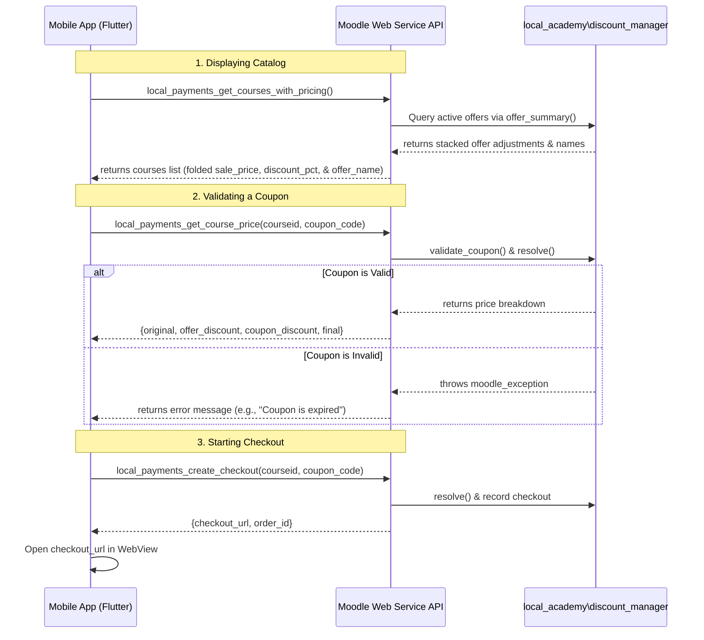

# Coupons and Offers Integration — Mobile Developer Handoff

This document describes how discount **Coupons** and automatic **Offers** are designed, processed, and applied in Moodle, and how the Mobile App (Flutter) should consume the API to display and process them correctly.

---

## 1. Core Concepts & Business Rules

Discounts are managed by the `local_academy` plugin via the shared engine: [`discount_manager`](file:///d:/My%20work/NIT/Projects/Academy/academy/src/local/academy/classes/discount_manager.php).
There are two distinct types of discounts:

### A. Automatic Offers (US-US-OF-*)
* **Application**: Applied **automatically** based on database rules. No user action is required.
* **Stacking Behavior**: If a course matches multiple active, valid offers, the offers **stack** (their discount values are summed).
* **Final Offer Price**: Base Price $-$ Sum of all applicable offer discounts (clamped to a minimum of `0`).
* **Underlying Tables**:
  * `academy_offers`: Definition of the offer (discount type: percent/fixed, value, start/end dates, active status).
  * `academy_offer_items`: Association between the offer and the items (item type: `course`/`package`/`subscription`, and specific ID, where `0` means all items of that type).
  * `academy_offer_usages`: Logs offer redemption against transaction records.

### B. Promo Coupons (US-US-CP-*)
* **Application**: Applied **manually** by the user entering a promo/coupon code on the checkout screen.
* **Stacking Behavior**: A coupon code is applied **on top** of any active automatic offers. The discount is calculated using the remaining price *after* all offers have been applied.
* **Restrictions**: Coupon codes support:
  * Validity periods (start and end date).
  * Single or multiple redemptions (e.g., "once" across the platform, or a specific total usage limit).
  * Specific item types and item scopes.
  * A `max_discount` limit (e.g., `50%` discount up to a maximum of `50 EGP`).
* **Underlying Tables**:
  * `academy_coupons`: Definition of the coupon code, usage limits, and max discount caps.
  * `academy_coupon_items`: Association of the coupon with items.
  * `academy_coupon_usages`: Logs coupon redemption against transaction records.

---

## 2. Web Implementation (How it works on the website)

To understand how the app should behave, here is the flow used by the web front-end:

### A. Catalog Card Rendering
When rendering course cards (such as in the *"الكورسات التعليمية"* section), the web frontend calls [`\local_payments\price_resolver::card_context()`](file:///d:/My%20work/NIT/Projects/Academy/academy/src/local/payments/classes/price_resolver.php#L141).
1. `card_context()` gets country-resolved pricing via `price_resolver::resolve()`.
2. It then delegates to [`price_resolver::display_fields()`](file:///d:/My%20work/NIT/Projects/Academy/academy/src/local/payments/classes/price_resolver.php#L232), which:
   - Queries `\local_academy\discount_manager::offer_summary()`.
   - If offers apply, it alters the price fields:
     - Sets `is_sale_active = true`.
     - Updates `sale_price` to represent the final price after automatic offers.
     - Recalculates `discount_pct` based on the original price vs the final offer price.
     - Adds `offer_name` (a string containing names of applied offers, e.g., `"Flash Sale + Summer Discount"`).

### B. Checkout Flow
1. On the buy page (`/local/payments/buy.php`), students see the price and an optional Coupon Code input field.
2. Clicking buy submits the coupon code to `/local/payments/checkout.php`.
3. The checkout script calls [`\local_payments\manager::create_checkout()`](file:///d:/My%20work/NIT/Projects/Academy/academy/src/local/payments/classes/manager.php#L88) passing the `coupon_code` parameter:
   - Internally calls `apply_academy_discount()`, which invokes `discount_manager::resolve()`.
   - `discount_manager::resolve()` sums the offers, applies the coupon code on the remainder (checking validity), and returns the final checkout amount.
   - The user is redirected to the provider payment WebView (Kashier).
4. After successful payment, [`discount_manager::record_usage()`](file:///d:/My%20work/NIT/Projects/Academy/academy/src/local/academy/classes/discount_manager.php#L412) is called to log coupon and offer usage.

---

## 3. Mobile API Analysis & Discrepancies

The mobile developer wants to reproduce the same behaviors using the API. Currently, they use [`local_payments_get_courses_with_pricing`](file:///d:/My%20work/NIT/Projects/Academy/academy/src/local/payments/classes/external/get_courses_with_pricing.php).

Here are the issues/gaps identified in the current mobile webservices:

### Gap 1: Automatic Offers are NOT returned in catalog endpoints
* **Problem**: The catalog API `local_payments_get_courses_with_pricing` and the single-course pricing API `local_payments_get_course_price` map raw values directly from `price_resolver::resolve()`. They do **not** call `price_resolver::display_fields()`.
* **Consequence**: The mobile app catalog card will show the standard price (or standard price resolver sale price) but will **miss** any active `local_academy` automatic offers. However, if the user checks out, they *will* get charged the lower offer-adjusted price, causing a mismatch between the catalog display and the actual payment amount.
* **Required Change**: Backend developers should update the mobile webservices to fold in the `price_resolver::display_fields()` outputs, and include `offer_name` in the API output structure.

### Gap 2: Mobile Checkout does NOT support Coupon Codes
* **Problem**: The mobile endpoint [`local_payments_create_checkout`](file:///d:/My%20work/NIT/Projects/Academy/academy/src/local/payments/classes/external/create_checkout.php) currently only accepts:
  - `courseid` (int)
  - `country` (string)
  - `lang` (string)
* **Consequence**: There is no parameter to submit a `coupon_code` from the mobile app when creating a checkout session.
* **Required Change**: The `local_payments_create_checkout` webservice parameter declaration needs to be updated to accept an optional `coupon_code` parameter and pass it down to `manager::create_checkout()`.

### Gap 3: No real-time Coupon Code verification in the App
* **Problem**: To display coupon feedback (e.g. "Coupon Applied! You saved 50 EGP") on the mobile checkout screen *before* redirecting to the WebView, the app needs a validation API.
* **Required Change**: Create a new endpoint or update `local_payments_get_course_price` to accept an optional `coupon_code` parameter. This endpoint should call `discount_manager::resolve()` and return the breakdown (`original`, `offer_discount`, `coupon_discount`, `final`, `coupon_code`) or throw a clear Moodle exception if the coupon is invalid (which the app can display as an error message).

---

## 4. How the App Developer should implement this

The App Developer should execute the following flows once the API gaps are resolved:

### Catalog Display (The Card View)
1. Call `local_payments_get_courses_with_pricing` to fetch the list of courses.
2. For each course card, check the pricing attributes:
   - If `is_free == true`: Show "Free" badge, button says "Join".
   - If `is_enrolled == true` or `is_purchased == true`: Show enrolled/purchased badge, button opens the course.
   - If `is_sale_active == true`:
     - Show the strike-through `original_price`.
     - Highlight the discounted `sale_price` (which includes automatic offers).
     - Show the discount percentage `discount_percentage%`.
     - If the API returns a non-empty `offer_name` (e.g., `"20% Off Ramadan Offer"`), render it as a promo banner/badge on the card.
   - Otherwise: Show standard `price` with a "Buy Now" button.

### Checkout & Coupon Application Flow
1. When the student clicks "Buy Now", open the in-app Checkout Details page.
2. Show the item details, original price, and active automatic offer discounts.
3. Provide a **Coupon Code** text field with an "Apply" button.
4. **When user enters a coupon code and taps "Apply"**:
   - Call the pricing validation API (e.g. updated `local_payments_get_course_price(courseid, country, coupon_code)`).
   - **If the coupon is valid**: Update the checkout screen display:
     - Show the new `final_price`.
     - Show a success label (e.g., `"Coupon <CODE> applied: -<value> EGP"`).
   - **If the coupon is invalid**: The API returns a Moodle Exception (e.g., `err_couponexpired`, `err_couponusedup`). Display the translated error message directly to the user (e.g., "This coupon code has expired").
5. **Proceeding to Payment**:
   - Call `local_payments_create_checkout(courseid, country, lang, coupon_code)`.
   - Open the returned `checkout_url` in an in-app WebView.
   - Complete the payment and verify using `local_payments_verify_payment(order_id)`.

---

## 5. Summary of Recommended Backend Changes

To unblock the mobile app developer, the backend team must implement these changes:

### Action Items for Backend:
1. **In `src/local/payments/classes/external/get_courses_with_pricing.php` & `get_course_price.php`**:
   Update them to use `price_resolver::display_fields()` or query `discount_manager::offer_summary()` to return the correct offer-adjusted price and `offer_name`.
2. **In `src/local/payments/classes/external/create_checkout.php`**:
   Add an optional `coupon_code` parameter to the webservice input parameter list and pass it to `manager::create_checkout()`.
3. **Optional Coupon Preview Endpoint**:
   Modify `local_payments_get_course_price` to accept a `coupon_code` parameter, validate it, and return the resolved breakdown.
