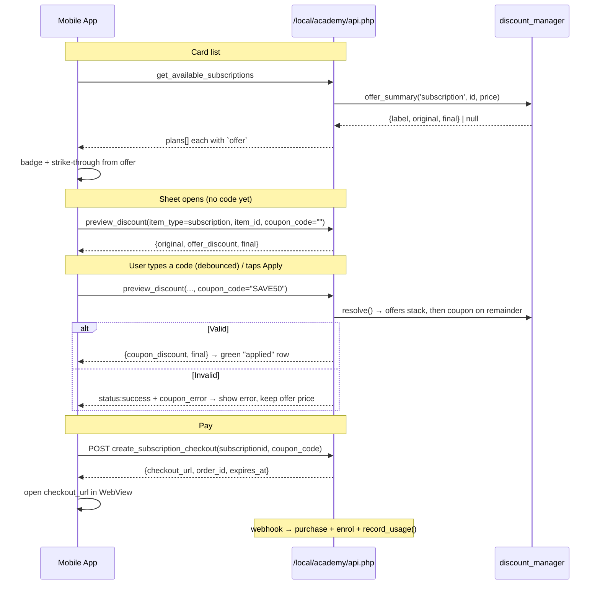

# "Available subscriptions" cards — Offers & Coupons — Mobile Developer Guide

How to show automatic **offers** on the subscription cards and let a student **apply a coupon code**
before paying — mirroring exactly what the website does at
[academy2026.nitg-eg.com](https://academy2026.nitg-eg.com/) in the *"Available subscriptions"* section.

> ✅ **No backend work is required for this flow.** Every endpoint below already exists and is live.
> The web front page ([`lib.php`](../src/local/academy/lib.php)) is built on these same three calls —
> if the app calls them the same way, it behaves identically.
>
> ⚠️ Do not confuse this with [`coupons-offers-mobile-handoff.md`](coupons-offers-mobile-handoff.md),
> which covers **courses** via the `local_payments_*` web services. That one *does* have open gaps.
> **Subscriptions use a different API** (`/local/academy/api.php`) and are complete.

Implements [US-US-OF-1-1/1-2](specs/student/) (offers) and [US-US-CP-1-2](specs/student/) (coupons).

---

## 1. The three calls you need

| # | Purpose | `function` | Method |
|---|---------|-----------|--------|
| 1 | Card list + offer badge | `get_available_subscriptions` | GET |
| 2 | Live price preview / validate coupon | `preview_discount` | GET |
| 3 | Start payment | `create_subscription_checkout` | **POST** |

Base endpoint — action chosen by the `function` param:

```
{BASE_URL}/local/academy/api.php?function=...&token=...
```

- **Auth**: `token` on every call (from `POST /login/token.php`, `service=moodle_mobile_app`).
- **Language**: pass `alang=en|ar` — **not** `lang`. Server error messages come back translated.
  (`lang` clobbers the session language; `alang` is the project's dedicated param.)
- **Envelope**: `{"status":"success","data":...}` or `{"status":"fail","error":"..."}`.
- ⚠️ An invalid/expired token returns an **HTML** page, not JSON → treat any non-JSON body as
  "session expired → re-login".

---

## 2. Business rules (these drive the UI)

Both discount kinds are computed by the shared engine
[`discount_manager`](../src/local/academy/classes/discount_manager.php). You never compute prices in
the app — always display what the server returns.

| | **Offers** (automatic) | **Coupons** (manual) |
|---|---|---|
| Applied | Automatically, by admin rule | Only when the user types a code |
| User action | None | Enter code → Apply |
| Where it shows | Card badge + strike-through price | Checkout sheet only |

**Order of operations** — this is why you must not do the math client-side:

1. Start from the plan's `price`.
2. **Offers stack**: every matching active offer's discount is computed on the *base* price and
   **summed** (two 30% offers = 60% off, not 51%).
3. **Coupon applies on the remainder**, i.e. on the *offer-adjusted* price — not on the base.
4. A coupon may have a `max_discount` cap (e.g. "50% off, up to 50 EGP").
5. Final price is clamped to **≥ 0**.

**Three rules that will bite you if you miss them:**

- 🚫 **B2B purchases ignore offers and coupons entirely.** A B2B checkout
  (`type=b2b&seats=N`) is priced only by its seat-option discount; any `coupon_code` you send is
  silently ignored. **Hide the coupon field on the B2B sheet** — see
  [`manager.php:400`](../src/local/payments/classes/manager.php#L400).
- 👤 **One active *normal* subscription at a time.** If the user already holds one, checkout throws
  `err_alreadyhassubscription`. The web disables the Subscribe button and shows one note under the
  heading rather than repeating it per card. B2B is separate and unaffected.
- 🔑 **`preview_discount` needs a token** → guests cannot preview. Guests should get a "Log in to
  subscribe" button, exactly as the web does.

---

## 3. Rendering the card — `get_available_subscriptions`

```
GET {BASE_URL}/local/academy/api.php?function=get_available_subscriptions&token=TOKEN&alang=en
```

Each plan already carries a ready-to-display `offer` object — **you do not need a separate call to
show the badge**:

```json
{
  "status": "success",
  "data": [
    {
      "id": 3,
      "name": "Premium Plan",
      "description": "Access to all premium courses",
      "price": "500.00",
      "duration_days": 30,
      "status": "active",
      "b2b_enabled": 1,
      "seat_options": [ { "seats": 10, "discount_percent": 15 } ],
      "courses": [ { "id": 12, "fullname": "Project Management" } ],
      "offer": {
        "name": "Ramadan Offer + Flash Sale",
        "discount_type": "percent",
        "discount_value": 30,
        "discount": 150.00,
        "original": 500.00,
        "final": 350.00,
        "label": "-30%"
      }
    }
  ]
}
```

### The `offer` field

- **`offer` is `null`** when no active offer applies → render the plain `price`, no badge.
- **`offer` is present** → render:
  - the red badge from **`offer.label`** (already formatted, e.g. `"-30%"`),
  - **`offer.original`** with a strike-through,
  - **`offer.final`** as the live price.
- **`offer.name`** is the combined offer name(s), joined with `" + "` when several stack — good as a
  subtitle/tooltip.
- ⚠️ **`offer.discount_type` is always `"percent"`** here, even when the underlying offer was a
  *fixed* amount. `discount_value` is the combined **effective** percentage. Just display `label`;
  don't re-derive it.

The web's exact treatment ([`lib.php:551`](../src/local/academy/lib.php#L551)):

```
s.offer  →  [ 500.00 ]  350.00 EGP      + red badge "-30%"
             ‾‾‾‾‾‾‾‾
no offer →  500.00 EGP
```

### Button state

| Condition | Button |
|---|---|
| No token (guest) | "Log in to subscribe" → login screen |
| This plan is the user's active one | "Active" (disabled) |
| User has another active normal plan | "Subscribed" (disabled) |
| Otherwise | "Subscribe" → open checkout sheet |
| `b2b_enabled && seat_options.length` | extra "Business (B2B)" button |

Merge with `get_my_subscriptions` to compute these — the web fetches both in parallel and treats only
`type === 'normal' && status === 'active'` as "has an active plan".

---

## 4. The checkout sheet & coupons — `preview_discount`

This is the endpoint that makes the coupon field work. Call it:

- **once when the sheet opens**, with an empty code → shows the automatic-offer price;
- **on "Apply"**, on Enter, and **debounced (~450 ms) while typing** — the web live-updates the total
  as the user types, so they never *have* to tap Apply.

```
GET {BASE_URL}/local/academy/api.php
    ?function=preview_discount
    &item_type=subscription      ← literal string
    &item_id={plan.id}           ← the subscription id, NOT the purchase id
    &coupon_code=SAVE50          ← omit or send "" for the offer-only price
    &token=TOKEN&alang=en
```

Response:

```json
{
  "status": "success",
  "data": {
    "original": 500.00,
    "offers": [ { "id": 2, "name": "Ramadan Offer", "discount": 150.00 } ],
    "offer_id": 2,
    "offer_name": "Ramadan Offer",
    "offer_discount": 150.00,
    "coupon_id": 7,
    "coupon_code": "SAVE50",
    "coupon_discount": 50.00,
    "discount": 200.00,
    "final": 300.00
  }
}
```

| Field | Use it for |
|---|---|
| `original` | Strike-through base price |
| `offer_discount` | "Offer discount" row (combined; `offers[]` has the breakdown) |
| `offer_name` | Names of applied offers (comma-joined here) |
| `coupon_discount` | "Coupon discount" row |
| `discount` | Total saved (`original - final`) — the web shows this as one green row |
| `final` | **The amount charged.** Show it as the total. |
| `coupon_error` | Present **only** when the code was rejected — see below |

### ⚠️ The single biggest gotcha: an invalid coupon still returns `status: "success"`

`preview_discount` deliberately **does not fail** on a bad code. It recomputes the price *without* the
coupon and adds a `coupon_error` field, so the sheet can show the offer price **and** the error at the
same time ([`api.php:1234`](../src/local/academy/api.php#L1234)):

```json
{
  "status": "success",
  "data": {
    "original": 500.00,
    "offer_discount": 150.00,
    "coupon_discount": 0.00,
    "discount": 150.00,
    "final": 350.00,
    "coupon_error": "This coupon code has expired"
  }
}
```

So your handler must be:

```dart
final d = res['data'];
totalText   = money(d['final']);            // always trust `final`
discountText = money(d['discount']);
couponError = d['coupon_error'];            // null ⇒ valid (or no code sent)
couponApplied = (d['coupon_discount'] ?? 0) > 0;
```

**Do not** gate on `status`, and **do not** assume a coupon applied just because the user typed one —
check `coupon_discount > 0` / the absence of `coupon_error`.

`coupon_error` is already **translated** per `alang` — display it verbatim. Possible causes:

| Reason | String key |
|---|---|
| No such code | `err_couponnotfound` |
| Deactivated | `err_couponinactive` |
| Not started yet | `err_couponnotstarted` |
| Expired | `err_couponexpired` |
| Doesn't cover this plan | `err_couponnotapplicable` |
| Usage limit reached | `err_couponusedup` |
| Empty code sent | `err_couponcoderequired` |

---

## 5. Paying — `create_subscription_checkout`

**POST** (a GET returns `{"status":"fail","error":"This action requires POST"}`), form-encoded:

```
POST {BASE_URL}/local/academy/api.php
Content-Type: application/x-www-form-urlencoded

function=create_subscription_checkout
&token=TOKEN
&subscriptionid=3
&coupon_code=SAVE50      ← send the SAME code the user previewed; omit if none
&type=normal             ← optional: normal | b2b
&seats=0                 ← B2B only, must match a seat_options entry
&alang=en
```

```json
{
  "status": "success",
  "data": {
    "order_id": "ORD-XXXX",
    "checkout_url": "https://checkout.kashier.io/?...",
    "expires_at": 1760000000,
    "provider": "kashier",
    "transaction_id": 123
  }
}
```

Then: **open `checkout_url` in a WebView** → the user pays → the purchase, enrolment, and
offer/coupon **usage logging** all happen server-side on the payment webhook. The app does not report
success itself; refresh `get_my_subscriptions` when the WebView returns.

The server **re-resolves the price from scratch** on this call — it never trusts a client-sent amount.
Two consequences:

1. The coupon is **re-validated** here. If it expired or hit its limit between preview and pay, this
   call returns `{"status":"fail", "error":"..."}` → surface the error and re-preview.
2. `expires_at` bounds the payment session (default 30 min). Past it, create a new checkout.

---

## 6. End-to-end flow



---

## 7. Optional: the "My coupons & offers" screen

Not needed for the cards, but available (token only, all GET):

| `function` | Returns |
|---|---|
| `get_available_coupons` | Active, in-window coupons — `code`, `discount_type`, `discount_value`, `max_discount`, `usage_type`, `usage_limit`, `usage_count`, `startdate`, `enddate`, `applies_to[]` (each `{item_type, item_id, label}`) |
| `get_available_offers` | Active, in-window offers, same shape minus `code` |
| `get_my_coupon_usages` | The user's redemptions — `code`, `item_type`, `item_id`, `original_amount`, `discount_amount`, `final_amount`, `timecreated` |
| `get_my_offer_usages` | Same, for offers |

In `applies_to`, **`item_id: 0` means "all items of that type"** (e.g. `{item_type:"subscription",
item_id:0}` = every plan). Use `label` for display — it's already resolved server-side.

> `get_available_coupons` lists coupons **platform-wide**; it does not filter by what this user can
> still use, and it exposes codes. It's fine for a "current promos" screen — but always confirm real
> applicability through `preview_discount`.

---

## 8. Checklist

- [ ] Card badge comes from `plan.offer.label`; `offer == null` ⇒ no badge, plain `price`
- [ ] Strike-through `offer.original`, show `offer.final`
- [ ] `preview_discount` on sheet open with an empty code (shows offer price)
- [ ] Debounce typing (~450 ms) + Apply button + Enter key all call `preview_discount`
- [ ] Handle `coupon_error` **inside a `status: success`** response
- [ ] Always display `final` from the server — never compute prices in the app
- [ ] Pass the same `coupon_code` to `create_subscription_checkout`; handle re-validation failure
- [ ] Hide the coupon field for B2B (`type=b2b`) — offers/coupons don't apply
- [ ] Guests: "Log in to subscribe", no preview call
- [ ] Non-JSON response ⇒ session expired ⇒ re-login

---

## 9. Reference — where this lives in the code

| Concern | File |
|---|---|
| Discount engine (stacking, validation, resolve) | [`discount_manager.php`](../src/local/academy/classes/discount_manager.php) |
| `offer` on each plan (`format_plan`) | [`subscription_purchase_manager.php:637`](../src/local/academy/classes/subscription_purchase_manager.php#L637) |
| `preview_discount` handler | [`api.php:1227`](../src/local/academy/api.php#L1227) |
| `create_subscription_checkout` handler | [`api.php:461`](../src/local/academy/api.php#L461) |
| Checkout + B2B exclusion rule | [`manager.php:366`](../src/local/payments/classes/manager.php#L366) |
| **Web reference implementation** (card + coupon modal) | [`lib.php:400-442`](../src/local/academy/lib.php#L400) |

When in doubt about a behavior, [`lib.php`](../src/local/academy/lib.php) is the ground truth — it is
the code running on the live site's "Available subscriptions" section.
